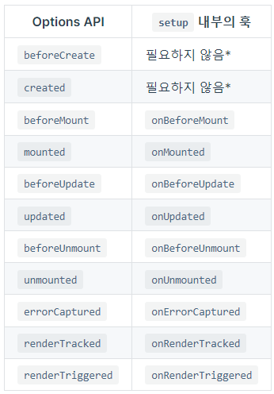

# Vue Lifecycle

Vue 인스턴스가 생성, 부착, 업데이트, 삭제 되는 일련의 라이프사이클은 아래와 같다.


각 라이프사이클 별로 훅(hook)이 존재하는데, 라이프사이클 훅은 Vue API 스타일마다 조금씩 다른데, 차이점은 아래와 같다.

- Vue2 - Options API: 인스턴스 내부에서 `beforeMount`, `mounted`처럼 라이프사이클 함수에 등록할 수 있다.

```html
// Options API
<script>
  export default {
    // mounted
    mounted() {
      console.log("mounted!");
    },
    updated() {
      console.log("updated!");
    },
    unmounted() {
      console.log("unmounted!");
    },
  };
</script>
```

- Vue3 - Composition API: import를 사용해 `onBeforeMount`, `onMounted`같이 `onX`형식의 라이프사이클 함수에 등록할 수 있다.

```html
// Composition API
<script setup>
import { onMounted, onUpdated, onUnmounted } from "vue";

const MyComponent = {
  setup() {
    onMounted(() => {
      console.log("mounted!");
    }),
    onUpdated(() => {
      console.log("updated!");
    }),
    onUnmounted(() => {
      console.log("unmounted!");
    });
  },
};
<script>
```

## vue2 vs vue3 lifecycle 차이점



> setup은 beforeCreate, created 라이프사이클 훅 사이에 실행되는 시점이므로(`beforeCreate()`가 `setup()` 직전에 호출되고 `created()`가 `setup()` 직후에 호출되는 타이밍을 가짐), 명시적으로 정의할 필요가 없다. 다시말해, 위의 두 훅(create)에서 작성되는 모든 코드는 `setup()` 내부에 작성해야한다.

## 참고 자료

- [vue docs - 라이프사이클 훅](https://v3.ko.vuejs.org/guide/composition-api-lifecycle-hooks.html)
