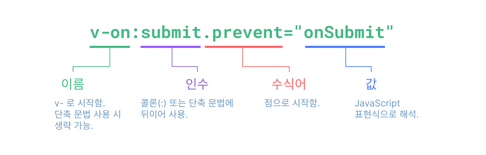

# vue

Vue는 사용자 인터페이스(UI)를 구축하기 위한 JavaScript 프레임워크이다.
Vue는 컴포넌트 기반 프로그래밍 모델을 갖고 있으며, [Vue 공식문서](https://v3-docs.vuejs-korea.org/)에서 **접근하기 쉬운**, **성능이 뛰어난**, **다재다능한** 자바스크립트 프레임워크라고 소개하고 있다. 왜 그렇게 소개하는지는 이 글에서 다루는 내용인 Vue의 기본 개념과 문법을 알아보도록 하자.

## Table of Contents

- [vue](#vue)
  - [Table of Contents](#table-of-contents)
  - [Single File Component](#single-file-component)
    - [SFC를 사용하는 이유](#sfc를-사용하는-이유)
  - [API 스타일](#api-스타일)
    - [옵션 API (Options API)](#옵션-api-options-api)
    - [컴포지션 API (Composition API)](#컴포지션-api-composition-api)
      - [`setup()`](#setup)
      - [`<script setup>`](#script-setup)
  - [vue 기본 개념과 문법 with Composition API](#vue-기본-개념과-문법-with-composition-api)
    - [템플릿 문법 (Template Syntax)](#템플릿-문법-template-syntax)
      - [텍스트 보간법](#텍스트-보간법)
      - [HTML 출력](#html-출력)
      - [속성 바인딩](#속성-바인딩)
    - [반응형 기초 (Reactivity)](#반응형-기초-reactivity)
      - [깊은 반응형](#깊은-반응형)
      - [reactive()를 사용한 반응형](#reactive를-사용한-반응형)
      - [ref()를 사용한 반응형](#ref를-사용한-반응형)
      - [reactive()와 ref()의 차이점](#reactive와-ref의-차이점)
    - [속성 바인딩 (Data Binding) `v-bind`](#속성-바인딩-data-binding-v-bind)
      - [`v-bind`](#v-bind)
    - [이벤트 리스너 (Event Listener, Event Handling) `v-on`](#이벤트-리스너-event-listener-event-handling-v-on)
      - [`v-on`](#v-on)
    - [폼 바인딩 (Form Binding) `v-model`](#폼-바인딩-form-binding-v-model)
      - [`v-bind`와 `v-on`](#v-bind와-v-on)
      - [`v-model`](#v-model)
    - [조건부 렌더링 (Conditional Rendering) `v-if`, `v-show`](#조건부-렌더링-conditional-rendering-v-if-v-show)
      - [`v-if`와 `v-else`](#v-if와-v-else)
      - [`v-else-if`](#v-else-if)
      - [`v-show`](#v-show)
      - [`v-if` with `v-for`](#v-if-with-v-for)
    - [리스트 렌더링 (List Rendering) `v-for`](#리스트-렌더링-list-rendering-v-for)
      - [`v-for`](#v-for)
    - [이외에 다양한 디렉티브(directive)](#이외에-다양한-디렉티브directive)
    - [계산된 속성 (Computed Property)](#계산된-속성-computed-property)
    - [생명주기와 템플릿 참조 (Lifecycle, Template ref)](#생명주기와-템플릿-참조-lifecycle-template-ref)
    - [감시자 (Watch)](#감시자-watch)
    - [컴포넌트 (Component)](#컴포넌트-component)
    - [자식 컴포넌트로 데이터 전달 (Props)](#자식-컴포넌트로-데이터-전달-props)
    - [부모 컴포넌트로 이벤트 전달 (Emits)](#부모-컴포넌트로-이벤트-전달-emits)
  - [참고 자료](#참고-자료)

## Single File Component

빌드 도구(vue CLI, vite)를 사용하는 대부분의 Vue 프로젝트는 HTML과 유사한 싱글 파일 컴포넌트(Single-File Component: SFC, `.vue`파일)라고 하는 파일 형식을 사용하여 Vue 컴포넌트는 작성한다.

`<template>`, `<script>`, `<style>`블록은 하나의 파일에서 컴포넌트의 뷰, 로직 및 스타일을 캡슐화하고 배치한다.

```vue
<!-- SFC 예제 -->
<script setup>
import { ref } from "vue";
const greeting = ref("안녕 Vue!");
</script>

<template>
  <p class="greeting">{{ greeting }}</p>
</template>

<style>
.greeting {
  color: red;
  font-weight: bold;
}
</style>
```

### SFC를 사용하는 이유

SFC 사용을 위해 빌드 방식을 따라야 하지만(대부분의 프로젝트가 빌드도구를 이용한다.) 다음과 같은 이점이 있다.

- 친숙한 HTML, CSS, JS문법을 사용해 모듈화된 컴포넌트 작성
- 뷰, 로직, 스타일이 본질적으로 사용 목적에따라 한 파일내에 구성
- 사전 컴파일된 템플릿
- 컴포넌트 범위 CSS(scoped CSS)
- 컴포지션 API로 작업할 때 더욱 인체공학적인 문법
- 개발 시 변경 사항을 뷰에 바로 적용시켜주는 HMR(Hot-Module Replacement)지원

## API 스타일

### 옵션 API (Options API)

**옵션 API**는 Vue component를 작성하는 오래된 방법이다.
아래는 옵션 API에서 사용할 수 있는 함수와 특징들이다.

- `data()`함수를 이용해 `reactive state`를 만든다.
- `computed`속성을 이용해 `reactive state`의 변경을 감지해 읽기 전용인 계산된 값을 만든다.
- `methods`, `props`, `watch` 등의 속성들을 이용해. `exported object`에 포함할 수 있다.
- `beforeCreate`, `created()`, `beforeMount()`, `mounted()`, `updated()`등 `lifecycle hook`을 이용해서 각 `lifecycle`단계에 로직을 작성할 수 있다.

옵션 API를 사용하는 경우, 옵션의 `data`, `methods` 및 `mounted`같은 객체를 사용해 컴포넌트 로직을 정의한다.
옵션으로 정의된 속성을 컴포넌트 인스턴스를 가리키는 함수 내부의 `this`에 노출된다. 즉, **옵션으로 정의된 속성에 접근할 때 `this`로 접근**가능하다.

아래는 옵션 API 예시 SFC 코드이다.

```vue
<script>
export default {
  // data()에서 반환된 속성들은 반응적인 상태가 되어 `this`에 노출된다.
  data() {
    return {
      count: 0,
    };
  },

  // computed는 속성 값이 변경을 감지하면 return값에 적용되는 함수.
  computed: {
    countString() {
      return `Total count: ${this.count}`
    }
  }

  // methods는 속성 값을 변경하고 업데이트 할 수 있는 함수.
  // 템플릿 내에서 이벤트 리스너로 바인딩 될 수 있음.
  methods: {
    increment() {
      this.count++;
    },
  },

  // 생명주기 훅(Lifecycle hooks)은 컴포넌트 생명주기의 여러 단계에서 호출된다.
  // 이 함수는 컴포넌트가 마운트 된 후 호출된다.
  mounted() {
    console.log(`숫자 세기의 초기값은 ${this.count} 입니다.`);
  },
};
</script>

<template>
  <button @click="increment">숫자 세기: {{ count }}</button>
  <p>{{ countString }}</p>
</template>
```

### 컴포지션 API (Composition API)

컴포지션 API는 Vue component를 작성하는 새로운 방법이다.
아래는 컴포지션 API에서 사용할 수 있는 함수와 특징들이다.

- `ref()`, `reactive()`를 이용해 `reactive state`를 만든다.
- `computed()`, `watch()`, `watchEffect()`를 이용해 `reactive state`의 변경을 감지한다.
- `onMounted()`, `onBeforeMount()`, `onUpdate()`등 `lifecycle hook`을 이용해서 각 `lifecycle`단계에 로직을 작성할 수 있다.
- 컴포지션 API는 `setup()`함수와 `<script setup>`(Vue에서 추천하는 방식)을 이용해 컴포넌트를 작성할 수 있다.
  - 옵션 API와 다른 점으로 컴포지션 API는 `create hook` 이 따로 존재하는것이 아니라 `setup` 이전 이후로 `onBeforeCreate`, `onCreated`가 실행된다.

아래는 컴포지션 API 예시 SFC 코드이다.

```vue
<script setup>
import { ref, computed, onMounted } from "vue";

// 반응적인 상태의 속성
const count = ref(0);
const countString = computed(() => {
  return `Total count: ${count}`;
});

// 속성 값을 변경하고 업데이트 할 수 있는 함수.
function increment() {
  count.value++;
}

// 생명 주기 훅
onMounted(() => {
  console.log(`숫자 세기의 초기값은 ${count.value} 입니다.`);
});
</script>

<template>
  <button @click="increment">숫자 세기: {{ count }}</button>
</template>
```

#### `setup()`

> 싱글 파일 컴포넌트(SFC)를 이용하는 경우 `setup()`훅을 이용하기 보다 간결하고 인체공학적 문법을 사용하기 위해 `<script setup>`을 사용하는것을 권장한다.
> 보통 프로젝트에는 빌드도구를 이용해 SFC로 Vue코드가 작성되기 때문에 `<script setup>`을 사용하는게 자연스러울 것이다.

`setup()` 훅은 다음과 같은 경우, 컴포넌트에서 컴포지션 API 사용을 위한 진입점 역할을 한다.

- 빌드 과정 없이 컴포지션 API 사용.
- 옵션 API 컴포넌트에서 컴포지션 API 기반 코드와 통합.

#### `<script setup>`

`<script>`같은 일반적인 script 태그의 경우는 컴포넌트가 처음 import될 때 한번 실행되는 반면, `<script setup>`는 컴포넌트 인스턴스가 생성될 때마다 실행된다.

`<script setup>`문법은 `setup()`함수 문법보다 더 많은 이점을 제공한다.

- 더 적은 상용구(boilerplate) 사용
- 더 나은 런타임 퍼포먼스
- 효과적인 타입스크립트 사용
- 더 나은 IDE 타입 추론 기능

주의 사항으로 `<script setup>`태그는 모듈을 포함할 수 없다.(`<script setup>` cannot contain ES module)

위와 같은 이유로 Vue core team에서는 `<script setup>`문법을 추천한다.

참고

- [Composition API VS Options API in Vue 3 For Beginners](https://www.webmound.com/composition-api-vs-options-api-in-vue-3/)

## vue 기본 개념과 문법 with Composition API

### 템플릿 문법 (Template Syntax)

Vue는 컴포넌트 인스턴스의 데이터를 서술적으로 렌더링된 **DOM에 바인딩할 수 있는** HTML 기반 **템플릿 문법**을 사용한다.

#### 텍스트 보간법

데이터 바인딩을 할 때 가장 기본적으로 사용하는 "Mustache"(이중 중괄호) 문법을 사용한 텍스트 보간법이다.

```vue
<template>
  <span>메세지: {{ msg }}</span>
</template>
<script setup>
import { ref } from "vue";
const msg = ref("뷰 reactive 메세지입니다.");
</script>
```

이중 중괄호 태그 내 `msg`는 해당 컴포넌트 인스턴스인 `msg` 속성의 값으로 대체된다. 또한 `msg` 속성이 변경될 때마다 업데이트된다.(reactive 특성)

#### HTML 출력

이중 중괄호는 데이터를 HTML이 아닌 일반 텍스트로 해석해서 태그까지 같이 렌더링된다. HTML을 파싱해서 렌더링하고싶다면, `v-html`디렉티브를 사용해야 한다.

```vue
<template>
  <p>텍스트 보간법 사용: {{ rawHtml }}</p>
  <p>v-html 디렉티브 사용: <span v-html="rawHtml"></span></p>
</template>
<script setup>
import 'ref' from 'vue'
const rawHtml = ref(`<span style="color: red">이것은 빨간색이어야 합니다.</span>`)
</script>
```

#### 속성 바인딩

이중 중괄호는 HTML 속성값에 사용할 수 없다. 대신 이중 중괄호 없이 동적인 속성값을 써주면 된다.

```vue
<template>
  <h1 v-bind:id="dynamicId">Title</h1>
</template>
<script setup>
import { ref } from "vue";
const dynamicId = ref("title");
// 값이 변경돼 재 렌더링 돼야 하는 경우가 아니라면 아래와 같이 사용해도 무관하다. 반응성(reactive)는 이후에 다룰 내용이다.
// const dynamicId = "title";
</script>
```

### 반응형 기초 (Reactivity)

`reactive()`, `ref()`를 사용해서 만든 반응형 상태(reative state)를 변경하면 DOM이 자동으로 업데이트된다. 그러나 DOM 업데이트는 동기적으로 적용되지 않는점에 유의해야 한다. 대신 Vue는 업데이트 주기의 "다음 틱(tick)"까지 버퍼링하여 상태 변경을 여러번 수행했어도 각 컴포넌트가 한 번만 업데이트된다.(효율적 렌더링)

상태 변경 후, DOM 업데이트가 완료될 떄 까지 기다리려면 `nextTick()`전역 API를 사용할 수 있다.

```js
import { nextTick } from "vue";

function increment() {
  state.count++;
  nextTick(() => {
    // 업데이트된 DOM에 접근 가능
  });
}
```

#### 깊은 반응형

Vue는 기본적으로 반응형 상태를 내부 깊숙이 추적해, 중첩된 객체나 배열을 변경할 떄에도 변경 사항이 감지된다.

#### reactive()를 사용한 반응형

reactive() 함수를 사용하여 **객체 또는 배열을 반응형**으로 만들 수 있다.

```js
import { reactive } from "vue";

const state = reactive({ count: 0 });
```

reactive() API는 두 개의 제한 사항이 있다.

객체, 배열 그리고 Map이나 Set과 같은 컬렉션 유형에만 작동한다. string, number 또는 boolean과 같은 기본 유형에 사용할 수 없다.

Vue의 반응형 변경 감지는 속성에 접근함으로써 작동하므로, 항상 반응형 객체에 대한 동일한 참조를 유지해야 한다. 즉, 첫 번째 참조에 대한 반응형 연결이 손실되기 때문에 반응형 객체를 쉽게 "교체"할 수 없음을 의미한다.

#### ref()를 사용한 반응형

Vue는 reactive()의 제한 사항을 해결하기 위해, 어떠한 유형의 데이터라도 반응형으로 재정의할 수 있는 ref() 함수를 제공한다.

```js
import { ref } from "vue";

const count = ref(0);
```

ref는 받은 인수를 .value 속성을 포함하는 ref객체에 래핑 후 반환한다.
따라서 값에 접근하려면 .value로 접근해야한다.

```js
console.log(count); // {value: 0}
console.log(count.value); // 0
count.value++;
console.log(count.value); // 1
```

#### reactive()와 ref()의 차이점

reactive는 기존 뷰 문법의 data 속성 느낌이고, ref는 좀 더 리액티브 속성을 개별적으로 선언하는 느낌이다.
reactive는 `객체.값`으로 접근 가능하고 ref는 `값.value`로 접근 가능하다.

```js
// reactive
const event = reactive({
  count: 3,
  doubled: computed(() => event.count * 2),
});

// ref
const count = ref(3);
const doubled = computed(() => count.value * 2);
```

참고

- [https://joshua1988.github.io/vue-camp/vue3.html#reactive%E1%84%8B%E1%85%AA-ref%E1%84%8B%E1%85%B4-%E1%84%8E%E1%85%A1%E1%84%8B%E1%85%B5%E1%84%8C%E1%85%A5%E1%86%B7](https://joshua1988.github.io/vue-camp/vue3.html#reactive%E1%84%8B%E1%85%AA-ref%E1%84%8B%E1%85%B4-%E1%84%8E%E1%85%A1%E1%84%8B%E1%85%B5%E1%84%8C%E1%85%A5%E1%86%B7)

### 속성 바인딩 (Data Binding) `v-bind`

#### `v-bind`

`v-bind`디렉티브를 이용해서 속성 바인딩을 할 수 있다.
`v-bind:속성명=속성값"`으로 속성을 바인딩하며 바인딩 할 때는 동적 값을 `{{속성값}}`이 아닌 `"속성값"`으로 바인딩한다. 축약형은 `:속성명="속성값"`으로 똑같이 바인딩 할 수 있다.
속성에 동적 값을 바인딩하는것이 아닌 정적 값을 넣고 싶은 경우는 `속성명="속성값"`으로 기존과 동일하게 적용 가능하다.

> 이후 부모 컴포넌트에서 자식 컴포넌트로 props를 전달할 때도 `v-bind`디렉티브를 이용해 동적 값을 전달할 수 있다.

```vue
<script setup>
import { ref } from "vue";
const titleId = ref("title");
</script>
<template>
  <div v-bind:id="dynamicId" class="a">글자가 빨간 색이 됩니다.</div>
</template>
<style>
#title {
  color: red;
}
.a {
  background-color: blue;
}
</style>
```

### 이벤트 리스너 (Event Listener, Event Handling) `v-on`

#### `v-on`

`v-on`디렉티브를 사용해서 DOM 이벤트틑 수신할 수 있다.
`v-bind`디렉티브와 동일하게 `v-on:이벤트명="함수명"`로 이벤트를 바인딩할 수 있으며, 축약형은 `@:이벤트명="함수명"`으로 똑같이 바인딩 할 수 있다.

또한 `v-on`과 이후에 나올, `v-model` 디렉티브 전용으로 수식어가 있다.
수식어는 `.`으로 시작하는 특수한 접미사로, 디렉티브가 특별한 방식으로 바인딩돼야 할때 사용한다. 예를 들어 `form`태그에 `sumbmit`이벤트가 발생할 때 페이지 리로드를 막아주는 `preventDefault()`와 비슷한 동작을 하는 수식어인 `prevent`를 사용하여 `<form @sumbmit.prevent="onSubmit">...</form>`처럼 작성하면 페이지가 리로드 되는것을 막을 수 있다.

> 이후 자식 컴포넌트의 emit으로 전달한 이벤트를 부모 컴포넌트에서 `v-on`디렉티브를 이용해 이벤트를 전달받을 수 있다.

```vue
<script setup>
import { ref } from "vue";

const count = ref(0);
const increment = () => {
  count.value++;
};
const onSumbmit = () => {};
</script>

<template>
  <button v-on:click="increment">숫자 세기: {{ count }}</button>
  <form @submit.prevent="onSubmit">...</form>
</template>
```

아래는 전체적인 디렉티브 문법을 시각화 한것이다.


### 폼 바인딩 (Form Binding) `v-model`

#### `v-bind`와 `v-on`

`v-bind`와 `v-on`디렉티브를 함께사용해서 폼 안의 입력 엘리먼트에 양방향 바인딩을 구현할 수 있다.

```vue
<script setup>
import { ref } from "vue";

const text = ref("");

function onInput(e) {
  text.value = e.target.value;
}
</script>

<template>
  <input :value="text" @input="onInput" placeholder="여기에 입력하기" />
  <p>{{ text }}</p>
</template>
```

#### `v-model`

vue는 이런 양방향 바인드를 단순화하기 위해, 위 문법을 간편하게 표기하는 `v-model`디렉티브를 제공한다.

```vue
<script setup>
import { ref } from "vue";

const text = ref("");
</script>

<template>
  <input v-model="text" placeholder="여기에 입력하기" />
  <p>{{ text }}</p>
</template>
```

v-model은 텍스트 입력 외에도 체크박스, 라디오 버튼, 셀렉트 드롭다운과 같은 다른 입력 타입에서도 작동한다. 따라서 `v-bind`, `v-on`으로 양방향 바인딩하는것보다 `v-model`을 이용하도록 하자.

### 조건부 렌더링 (Conditional Rendering) `v-if`, `v-show`

#### `v-if`와 `v-else`

vue에서는 조건부 렌더링을 위해 `v-if`디렉티브를 제공한다.
사용법으로 `v-if="boolean value"`에서 `boolean value"`가 참인 경우만 해당 앨리먼트가 렌더링 된다. `v-else`디렉티브는 `v-if="boolean value"`가 거짓인 경우 렌더링 된다.
여기서 중요한 점은 `boolean value`값이 `truthy`인 경우만 렌더링 되며, `falsy`값으로 변경되면 DOM에서 제거된다.

```vue
<script setup>
import { ref } from "vue";

const awesome = ref(true);

function toggle() {
  awesome.value = !awesome.value;
}
</script>

<template>
  <button @click="toggle">토글 버튼</button>
  <!-- h1은 awesome값이 truthy인 경우만 렌더링 되며, falsy값으로 변경되면 DOM에서 제거된다. -->
  <h1 v-if="awesome">Vue는 굉장해! 엄청나!</h1>
  <h1 v-else>오 안돼 😢</h1>
</template>
```

#### `v-else-if`

`v-else-if`디렉티브도 존재하는데, 이건 js에서 else if의 개념과 비슷하다.

```vue
<div v-if="type === 'A'">
  A
</div>
<div v-else-if="type === 'B'">
  B
</div>
<div v-else-if="type === 'C'">
  C
</div>
<div v-else>
  A/B/C 아님
</div>
```

#### `v-show`

`v-show`디렉티브도 엘리먼트를 조건부로 표시하는 방법 중 하나이며 참인 경우 보여주고, 거짓인 경우 보여주지 않는다. `v-show`디렉티브를 사용한 엘리먼트는 조건에 상관없이 항상 렌더링되고 DOM에 남아있다. 즉, `v-show`는 엘리먼트를 렌더링 해놓고 `display`css 속성만 전환한다.

`v-if` vs `v-show`

> 엘리먼트를 매우 자주 전환해야 하는 경우 v-show를 사용하는 것이 좋고
> 실행 중에 조건이 변경되지 않는 경우 v-if를 사용하는 것이 좋다.

#### `v-if` with `v-for`

`v-if`와 `v-for`를 함께 사용되는것은 권장되지 않는다. `v-if` vs `v-for`를 함께 사용하면 `v-if`가 먼저 평가된다.

### 리스트 렌더링 (List Rendering) `v-for`

#### `v-for`

`v-for`디렉티브를 사용해서 배열이나 객체을 엘리먼트 리스트로 렌더링할 수 있다.

```vue
<script setup>
import { ref } from "vue";

// 각 할 일에 고유한 ID 부여
let id = 0;

const todos = ref([
  { id: id++, text: "HTML 배우기" },
  { id: id++, text: "JavaScript 배우기" },
  { id: id++, text: "Vue 배우기" },
]);
</script>

<template>
  <ul>
    <li v-for="todo in todos" :key="todo.id">
      {{ todo.text }}
      <button>X</button>
    </li>
  </ul>
</template>
```

### 이외에 다양한 디렉티브(directive)

- `v-text`: innerText, HTML태그를 포함한 문자를 그대로 앨리먼트의 내용으로 렌더링
- `v-html`: innerHtml, HTML태그를 파싱해서 적용된 HTML문서를 앨리먼트의 내용으로 렌더링
- `v-pre`: Vue의 텍스트 보간법인 콧수염(Mustach) 표현식에 값이 바인딩되는것이 아니라, 문자 그대로 `{{값}}`이 렌더링
- `v-once`: 처음 한 번만 렌더링
- `v-cloak`: `v-for`디렉티브를 이용해 많은 데이터를 출력할 때 콧수염 표현식이 화면에 일시적으로 나타나는 경우가 있는데, 이것은 아직 컴파일 되지 않은 템플릿이다. 아직 컴파일 되지않은 템플릿은 렌더링되지 않도록 하는게 `v-cloak` 디렉티브

### 계산된 속성 (Computed Property)

템플릿 내 표현식`{{표현식}}`은 매우 편하지만 간단한 작업만을 위한 것이다.
템플릿에 너무 많은 논리를 표현하려 하면 템플릿 코드가 비대해져 가독성에 좋지 않다.

```vue
<script setup>
import { ref, computed } from "vue";
const message = ref("hello vue!");
const reversedMessage = computed(() => {
  return message.value.split("").reverse().join("");
});
// 컴포넌트 로직
</script>

<template>
  <h1>original message: {{ message.split("").reverse().join("") }}</h1>
  <h1>computed message: {{ reversedMessage }}</h1>
  <h1>
    expression method message:
    {{
      (() => {
        return message.split("").reverse().join("");
      })()
    }}
  </h1>
</template>
```

위 코드에서 모든 h1태그에 `message.split("").reverse().join("")`과 `computedMessage`, 익명함수는 동일하게 렌더링된다.

### 생명주기와 템플릿 참조 (Lifecycle, Template ref)

아래는 vue의 instance가 생성될 때 진행되는 생명주기이다.
기본적인 흐름으로 `Create => Mount => Update => Unmount` 순서로 진행되며 각각 이전(ex] beforeOnMount)과 이후(ex] onMounted)가 존재한다.


```vue
<script setup>
import { ref, onMounted } from "vue";

const p = ref(null);
onMounted(() => {
  p.value.innerText = "1234";
});
</script>

<template>
  <p ref="p">안녕</p>
</template>
```

참고

- [https://v3-docs.vuejs-korea.org/guide/essentials/lifecycle.html#lifecycle-diagram](https://v3-docs.vuejs-korea.org/guide/essentials/lifecycle.html#lifecycle-diagram)
- [https://v3-docs.vuejs-korea.org/api/composition-api-lifecycle.html](https://v3-docs.vuejs-korea.org/api/composition-api-lifecycle.html)

### 감시자 (Watch)

vue에서 `watch(데이터, 콜백함수)`함수는 해당 데이터가 변경됐을 때 전달된 콜백함수를 실행하도록 한다.
혹시 react를 다루어 본 적이 있다면, react의 `useEffet(콜백함수, 데이터)`훅과 비슷한 동작을 한다고 이해하면 도움이 된다.

```vue
<script setup>
import { ref, watch } from "vue";

const todoId = ref(1);
const todoData = ref(null);

async function fetchData() {
  todoData.value = null;
  const res = await fetch(
    `https://jsonplaceholder.typicode.com/todos/${todoId.value}`
  );
  todoData.value = await res.json();
}

fetchData();
watch(todoId, fetchData);
</script>

<template>
  <p>할 일 id: {{ todoId }}</p>
  <button @click="todoId++">다음 할 일 가져오기</button>
  <p v-if="!todoData">로딩...</p>
  <pre v-else>{{ todoData }}</pre>
</template>
```

하나의 데이터를 기반으로 다른데이터를 변경할 필요가 있을 때 흔히 사용할 수 있는 계산된 속성(computed)과 비슷하지만, 감시자(watch)는 주로 긴 처리시간이 필요한 비동기 처리에 적합하다.

참고

- [https://v3-docs.vuejs-korea.org/guide/essentials/watchers.html](https://v3-docs.vuejs-korea.org/guide/essentials/watchers.html)
- [https://imagineu.tistory.com/74](https://imagineu.tistory.com/74)

### 컴포넌트 (Component)

컴포넌트란 조합하여 화면을 구성할 수 있는 블록을 의미한다. 컴포넌트를 활용하면 중복되는 코드를 줄일 수 있고 화면을 구조화해 일괄적인 패턴으로 개발할 수 있다. 즉, 코드를 쉽게 이해하고 재사용할 수 있다.

```vue
<!-- App.vue -->
<script setup>
import ChildComp from "./ChildComp.vue";
</script>

<template>
  <ChildComp />
</template>
```

```vue
<!-- ChildComp.vue -->
<template>
  <h2>자식 컴포넌트입니다!</h2>
</template>
```

참고

- [https://v3-docs.vuejs-korea.org/guide/essentials/component-basics.html](https://v3-docs.vuejs-korea.org/guide/essentials/component-basics.html)
- [https://velog.io/@sms8377/Javascript-Vue-%EC%97%90%EC%84%9C-%EC%BB%B4%ED%8F%AC%EB%84%8C%ED%8A%B8%EB%9E%80](https://velog.io/@sms8377/Javascript-Vue-%EC%97%90%EC%84%9C-%EC%BB%B4%ED%8F%AC%EB%84%8C%ED%8A%B8%EB%9E%80)

### 자식 컴포넌트로 데이터 전달 (Props)

자식 컴포넌트는 `props`속성으로 부모로부터 데이터를 받는다. 그리고 `props`를 받기 위해서는 `defineProps()`를 이용해 props를 선언해야 한다. props를 선언할 때 타입스크립트의 인터페이스처럼 받을 prop의 이름과 타입을 정해줘야 한다.

참고로 `defineProps()`는 컴파일 타임 매크로이므로 import할 필요가 없다.

부모는 props를 전달할 때 속성을 사용하는 것 처럼 propr을 전달할 수 있는데, 동적 값을 전달하기 위해 `v-bind`문법을 사용할 수도 있다.

```vue
<!-- App.vue -->
<script setup>
const greeting = "부모 컴포넌트가 전달한 msg입니다.";
</script>
<template>
  <ChildComp :msg="greeting" staticMsg="정적 값을 전달하는 메시지입니다." />
</template>
```

```vue
<!-- ChildComp.vue -->
<script setup>
const props = defineProps({
  msg: String,
  staticMsg: String,
});
</script>
<template>
  <h2>{{ msg || "prop이 아직 전달되지 않았습니다." }}</h2>
  <h3>{{ staticMsg }}</h3>
</template>
```

### 부모 컴포넌트로 이벤트 전달 (Emits)

자식 컴포넌트는 부모로부터 props를 받는것 뿐만 아니라 이벤트를 emit(발송)할 수 있다.

자식 컴포넌트에서 `defineEmits([이벤트명1, 이벤트명2, ...])`를 이용해 이벤트를 생성한다. 생성한 이벤트는 `defineEmits()`가 반환된 객체가 만약 `emit`이라고 한다면 `emit('이벤트명', '보낼 메세지')`로 이벤트와 함께 메세지를 전달할 수 있다.

아래는 emit을 활용한 간단한 예제이다.

```vue
<script setup>
import { ref } from "vue";
import ChildComp from "./ChildComp.vue";

const childMsg = ref("자식 컴포넌트로부터 아직 메시지를 받지 못했어요!");
</script>

<template>
  <ChildComp @response="(msg) => (childMsg = msg)" />
  <p>{{ childMsg }}</p>
</template>
```

```vue
<script setup>
const emit = defineEmits(["response"]);

emit("response", "자식 컴포넌트로부터 🌷를 받았어요!");
</script>

<template>
  <h2>자식 컴포넌트</h2>
</template>
```

## 참고 자료

- [vuejs tutorial - https://v3-docs.vuejs-korea.org/tutorial](https://v3-docs.vuejs-korea.org/tutorial)
- [vuejs docs - https://v3-docs.vuejs-korea.org/guide/essentials/reactivity-fundamentals.html#limitations-of-reactive](https://v3-docs.vuejs-korea.org/guide/essentials/reactivity-fundamentals.html#limitations-of-reactive)
